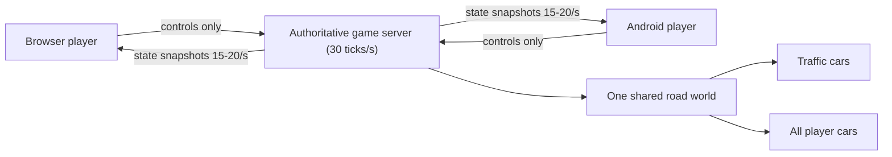

# Highway Rush — Master Plan

Online endless 3-lane highway racing game. Browser (desktop + mobile) **and** Android via Play Store. 1–6 players per private room, racing through moving traffic on an endless night highway.

---

## 1. Product goal

- Endless, three-lane highway driving game
- Multiplayer: 1–6 friends in a private room (no public matchmaking in v1)
- Gameplay: high-speed lane cutting through live traffic; two modes:
  - **Endless free drive** (default)
  - **Distance race**: 40 / 60 / 100 km (host chooses)
- Visual style: polished night city highway, realistic lighting, optimized for mobile
- Cars: CC0 / unbranded models only — **no real manufacturer logos, names, or ripped game assets**

---

## 2. Tech stack (locked)

| Area | Choice |
|---|---|
| Client | TypeScript + Vite + Three.js (WebGL2, GLTFLoader, instancing, selective bloom) |
| Server | Node.js + Socket.IO — **authoritative simulation**, 30 Hz fixed ticks |
| Shared logic | `packages/simulation` — pure, deterministic code run on BOTH server and client |
| Android | Capacitor wrapper → signed `.aab` for Google Play |
| Hosting | Render free tier — ONE service: static client + game server + WebSockets |
| Database | **None at launch** (in-memory rooms). Supabase free tier deferred to Phase 5+ |
| Assets | CC0 GLB cars, logged in `assets/CREDITS.md` |

---

## 3. Non-negotiable multiplayer rule

**Server-authoritative simulation.** Clients send ONLY control inputs:

```ts
{
  inputSequence: number,   // used for prediction/correction ordering
  steering: -1 | 0 | 1,
  throttle: 0..1,
  brake: 0..1,
  timestamp: number
}
```

The server owns and broadcasts:
- Every player's position, speed, crash state, respawns, penalties
- Every traffic car's ID, lane/position, speed, state
- Collisions, score, leaderboard, match start/finish/winner, room state

Clients NEVER send their own position, distance, speed, collision result, or score as truth.



---

## 4. World synchronization design

### Coordinate system (one global)
- `roadDistanceMeters: 0 → unlimited`
- `lanePosition: -1.0 → +1.0` (continuous — smooth steering, NOT tap-to-lane)

### Traffic
- Created **only on the server**, permanent ID while active
- Server simulates lane, distance, speed, braking, despawn
- Players receive only traffic within ~400–600 m of themselves
- Nearby players receive the **exact same traffic IDs and positions**
- Traffic despawns only when far from every player in the room
- Seeded server-side randomness for repeatable/debuggable spawning

### Player cars
- Local player predicts own movement instantly (responsive steering)
- Server sends corrections in 15–20 Hz snapshots
- Remote players rendered with ~100 ms interpolation buffer (smooth motion)
- **Server collision result always wins** — a client may briefly predict a near miss, then correct to a server-confirmed crash

### Crashes
- Simplified 2D collision capsules on the server (never the GLB mesh)
- Server-confirmed flow: crash → state = crashed → speed = 0 → 3 s respawn timer → penalty applied → crash event broadcast

### Precision
- Origin rebasing / road chunks so the "unlimited" road never hits floating-point glitches

---

## 5. Rooms and game modes

1. Player chooses display name
2. Host creates room → server generates a 5-character, non-confusing code
3. Friends join with the code (max 6 players)
4. Host picks: mode (endless / 40 / 60 / 100 km), traffic density
5. 5-second shared countdown → server starts the match
6. **Reconnect tokens**: on disconnect, car reserved 45 s; player can return to the same state
7. Rematch support after finish

v1 scope: private rooms only · max 6 players · no voice chat · no matchmaking · no accounts (guest name + reconnect token)

---

## 6. Controls

### Mobile
- Auto-throttle by default (or hold-to-drive option)
- Large left/right steering buttons; optional swipe steering
- Brake button
- Settings: steering sensitivity, vibration toggle, graphics preset
- Pause / reconnect overlay

### Desktop
- `A/D` or arrow keys: steer
- `W/S`: throttle / brake
- Gamepad: post-launch

---

## 7. Graphics & mobile performance

- Night city: PBR car materials, neon signs, streetlights, headlights/taillights, fog, color grading, selective bloom, ACES tone mapping
- Instanced buildings, lamp posts, lane markers, barriers; procedural/repeating road segments
- Camera FOV increases with speed; lightweight crash particles + screen shake
- Crash FX: particle burst, ghost flash during respawn

### Graphics presets
| Preset | Target |
|---|---|
| Low | older Android phones, 30 FPS |
| Medium | most Android phones, 45–60 FPS |
| High | modern phones + desktop, 60 FPS |

### Performance rules
- Instanced meshes for repeated scenery and traffic where possible
- LOD models for distant cars
- Compressed textures (KTX2/Basis) when feasible
- No dynamic shadows from every car (one moon light shadow only)
- Visible traffic count capped by preset
- Origin rebasing on the endless road
- First build stays compact; optional asset packs later

---

## 8. Security & fairness

- Validate every input's rate and range server-side
- Ignore impossible controls / forged timestamps
- Server computes distance, rank, crashes, awards
- Rate-limit room creation and join attempts
- HTTPS + WSS only in production
- Store minimal personal data
- Report/block only if public rooms are ever added

---

## 9. Free-tier hosting plan (Render + Supabase)

| Piece | Plan |
|---|---|
| Render free tier | ONE Node web service: serves built client + runs authoritative Socket.IO server. In-memory rooms (no Redis — overkill for 1–6 players). WebSockets supported; stays awake while players connected; ~1 min cold start after idle is acceptable |
| Supabase free tier | **Deferred** — Phase 5+: accounts (Supabase Auth), persistent stats/leaderboard (Postgres). No DB at launch |
| Client hosting | Vite build served by the same Render service (no separate static host) |
| Android | Capacitor wraps the same client; server URL points at the Render service (WSS) |

---

## 10. Development phases & acceptance checks

| Phase | Work | Done when |
|---|---|---|
| **0** | Game design lock: camera, handling, traffic density, UI, art direction, release scope | All core decisions fixed (this doc) |
| **1** | Offline playable prototype: endless 3-lane road, 1 arcade car, 20–30 traffic cars, keyboard + touch controls, collision/respawn, speedometer, Low/Med/High presets | Runs smoothly on a real mid-range Android phone (Chrome); fun for 5 uninterrupted minutes |
| **2** | Authoritative game server: 30 Hz simulation, server traffic spawning + collisions, client prediction, snapshots, interpolation | Two devices in the same room see identical traffic; server-confirmed crashes produce the same outcome for both |
| **3** | Private multiplayer rooms: codes, lobby, countdown, reconnect (45 s reserve), leaderboard, race finish, rematch | Six mixed browser/Android players complete a 10 km match |
| **4** | Visual polish + assets: night highway, buildings, lights, vehicle variety, audio, settings, loading screen, presets | Graphics stable on target Android test devices |
| **5** | Production hardening: logs, health monitoring, abuse protection, privacy policy, credits file, error handling, load tests | Reconnect, slow network, backgrounded app, server restart all tested |
| **6** | Google Play release: signed `.aab`, store listing, rating, Data Safety, closed test → production | Live on Play Store |
| **7** | Supabase phase (deferred): accounts, persistent stats | — |

---

## 11. Required project structure

```text
highway-rush/                     # this repo
├─ apps/
│   ├─ client/                    # Three.js browser/Capacitor client
│   └─ game-server/               # authoritative Socket.IO game server
├─ packages/
│   ├─ shared/                    # types, protocol events, constants
│   └─ simulation/                # deterministic road/car/traffic/collision logic
├─ assets/
│   ├─ cars/                      # CC0 GLBs (player + traffic pool)
│   ├─ environment/
│   └─ CREDITS.md                 # every asset + license verified
├─ docs/
│   ├─ game-design.md
│   ├─ network-protocol.md
│   ├─ privacy.md
│   └─ release-checklist.md
└─ README.md
```

---

## 12. Car assets (researched + verified)

### Strategy: mixed pack, tiered (locked)
| Use in game | Best source | Why |
|---|---|---|
| Traffic cars (primary) | [RGS_Dev Vehicle Pack](https://rgsdev.itch.io/free-low-poly-vehicles-pack) | Large, varied, game-ready CC0 pack: sedans, sports, SUV, van, bus, truck, taxi, emergency; separated wheels, tintable |
| Extra traffic variants | [Kenney Car Kit](https://www.kenney.nl/assets/car-kit) | 45 CC0 assets, lightweight (GLB repack available) |
| Far-distance / low-preset traffic | [Quaternius Cars Pack](https://quaternius.com/packs/cars.html) | 8 CC0 models, commercial allowed |
| Hero / player cars (1–2) | [Sketchfab](https://sketchfab.com/tags/commercial-use) — **CC0 or CC BY ONLY** | Best chance of detailed free models; search "sports coupe", "supercar concept", "street car" |
| Single filler vehicles | [Poly Pizza](https://poly.pizza/) | Direct GLTF/FBX; check license on every model |

### Hard rules
- **Require: downloadable + CC0 or CC BY only.** Never NC, ND, Editorial, ripped game assets (no "from Assetto Corsa / GTA / Forza / Real Racing" models).
- **No branded models** (Lamborghini, BMW, Mustang, Nissan…) even if the uploader picked CC BY — they may not own brand/trade-dress rights.
- **No real logos, badges, names, or license plates in the game.**
- The realistic truth: there is **no trustworthy free photorealistic big car pack** that is automatically Play-Store safe. Realistic cars come one-by-one and must be optimized.
- Optimized 3D cars + good lighting/bloom/fog look premium — never use a 1M-triangle download.

### Asset pipeline (every vehicle, before it ships)
```text
Download source file
→ verify exact license + save source URL (and license screenshot)
→ open in Blender → remove logos/badges/plates
→ target 5k–15k triangles for close mobile cars
→ create lower-detail LOD version
→ resize to real-world metres
→ set car forward direction + wheel positions
→ export compressed .glb
→ test on Android
→ add credit entry
```

### Credits format (in-game Credits page + assets/CREDITS.md)
```text
Traffic Vehicle Pack
Creator: RGS_Dev
Source: https://rgsdev.itch.io/free-low-poly-vehicles-pack
License: CC0 1.0 Universal

Player Car: "Concept Coupe"
Creator: [Creator name]
Source: [exact model page URL]
License: CC BY 4.0
Modified by: Highway Rush team
```

---

## 13. Google Play release checklist (Phase 6)

- Build signed `.aab` (not APK) — Google Play App Signing
- Target **Android 16 / API 36+** (mandatory for new submissions after **2026-08-31**)
- Store listing: title, description, screenshots, app icon, feature graphic
- Content rating questionnaire
- Privacy policy: in-app AND web page (I will draft)
- Accurate Data Safety form
- Release flow: internal test → closed test → production
- **Personal developer account requires: ≥ 12 opted-in testers for 14 consecutive days** before production access

---

## 14. What YOU (the user) must do — external tasks

| Phase | Task | Cost | When |
|---|---|---|---|
| 1–2 | Test on your Android phone via Chrome (link provided) | free | now-ish |
| 3 | Create Render account (render.com) + provide API token for deployment | free | before multiplayer deploy |
| 3 | (Optional) domain for server URL | ~$10/yr | optional |
| 5+ | Create Supabase account (supabase.com) | free | only for accounts/stats |
| 6 | Install Android Studio (developer.android.com/studio) — final signed build + keystore | free | before Play release |
| 6 | Google Play Developer account (play.google.com/console) | $25 one-time | before Play release |
| 6 | Store listing assets: screenshots, icon, feature graphic | free | before Play release |
| 6 | Recruit 12+ testers for 14-day closed test | free | before production |
| 6 | Approve privacy policy text (I draft it) | free | before Play release |

---

## 15. First task (Phase 1)

> TypeScript Vite + Three.js browser game: endless three-lane road, one arcade car, 20–30 traffic cars, smooth keyboard + touch controls, collision/respawn, speedometer, Low/Medium/High graphics settings. Must run in Chrome Android before adding Capacitor or multiplayer.
